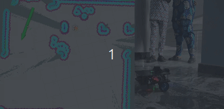

## Working with the Physical MoboBot (PART 2) | Running and Testing MoboBot



### Set MoboBot Base Type Environment Variable  
- Depending on the base chassis type you are using run any of the command below:

  ```shell
  export MOBOBOT_BASE_TYPE=2WD
  ```
  OR
  ```shell
  export MOBOBOT_BASE_TYPE=4WD
  ```
  OR
  ```shell
  export MOBOBOT_BASE_TYPE=MEC
  ```
  OR
  ```shell
  export MOBOBOT_BASE_TYPE=22WD
  ```

- add to your `.bashrc` file for auto sourcing 

  ```shell
  echo "export MOBOBOT_BASE_TYPE=2WD" >> ~/.bashrc
  ```
  OR
  ```shell
  echo "export MOBOBOT_BASE_TYPE=4WD" >> ~/.bashrc
  ```
  OR
  ```shell
  echo "export MOBOBOT_BASE_TYPE=MEC" >> ~/.bashrc
  ```
  OR
  ```shell
  echo "export MOBOBOT_BASE_TYPE=22WD" >> ~/.bashrc
  ```

#

### View Robot and Transform Tree
this shows the transformation between the differnt robot parts. it uses the **robot_state_publisher** the transforms, **RVIZ** to view the actual robot, and the **rqt_tf_tree** to view the transform graph.

##### On The Raspberry Pi
- open a new terminal and start the mobobot robot base bringup
  ```shell
  source ~/mobo_bot_ws/install/setup.bash && ros2 launch mobo_bot_description rsp.launch.py use_joint_state_pub:=true
  ```

##### On The Dev PC
- on your dev-PC, open a new terminal and launch the **tf_view** to view the transform
  ```shell
  source ~/mobo_bot_ws/install/setup.bash && ros2 launch mobo_bot_bringup tf_view.launch.py use_hardware:=true
  ```

#

### Launch the Physical MoboBot

##### On The Raspberry Pi
- start the mobobot robot base package for partail launch
  ```shell
  source ~/mobo_bot_ws/install/setup.bash && ros2 launch mobo_bot_base robot.launch.py # use_lidar:=true use_camera:=true
  ```
  OR
- start the mobobot robot bringup for full robot launch
  ```shell
  source ~/mobo_bot_ws/install/setup.bash && ros2 launch mobo_bot_bringup robot.launch.py # use_ekf:=true
  ```

##### On The Dev PC
- open a new terminal and start the mobo_bot_rviz by running
  ```shell
  source ~/mobo_bot_ws/install/setup.bash && ros2 launch mobo_bot_rviz robot.launch.py
  ```
  >NOTE: You should now see the robot visuals on your dev-PC

- In a different terminal, run the arrow_key_teleop to drive the robot around using the arrow keys on your keyboard
  ```shell
  source ~/mobo_bot_ws/install/setup.bash && ros2 run arrow_key_teleop_drive arrow_key_teleop_drive 0.15 0.7 true
  ```
  >NOTE: you would need to click into the rviz or simulation for the 
  > arrow_key_teleop drive to start woking. because it uses pynput
  >
  >NOTE: also feel free to use any other **teleop package** you want 

#

### Run the MoboBot Mapping (Drive robot with teleop) - SLAM

##### On The Raspberry Pi
- open a new terminal and start the mobobot robot mapping bringup
  ```shell
  source ~/mobo_bot_ws/install/setup.bash && ros2 launch mobo_bot_bringup robot_mapping.launch.py # use_ekf:=true
  ```

##### On The Dev PC
- open a new terminal and start the mobo_bot_rviz mapping_and_naviagion Vizualization by running
  ```shell
  source ~/mobo_bot_ws/install/setup.bash && ros2 launch mobo_bot_rviz mapping_and_navigation.launch.py
  ```
- In a different terminal, run the arrow_key_teleop to drive the robot around using the arrow keys on your keyboard
  ```shell
  source ~/mobo_bot_ws/install/setup.bash && ros2 run arrow_key_teleop_drive arrow_key_teleop_drive 0.15 0.7 true
  ```

##### On The Raspberry Pi
- run the command below to save the `occupancy grid` map to be used later with AMCL for localization 
</br>(map file would be saved in the `maps` folder inside the `mobo_bot_navigation` pakage folder)
 
  >```shell
  >   ros2 run nav2_map_server map_saver_cli -f /home/$USER/mobo_bot_ws/src/mobo_bot/mobo_bot_navigation/maps/<map_name> 
  >```

- run the command below to save the `serialized posegraph` map to be used later with SLAM for localization 
</br>(map file would be saved in the `maps` folder inside the `mobo_bot_navigation` pakage folder)
 
  >```shell
  >   ros2 service call /slam_toolbox/serialize_map slam_toolbox/srv/SerializePoseGraph "{filename: '/home/$USER/mobo_bot_ws/src/mobo_bot/mobo_bot_navigation/maps/<map_name>'}"
  >```

#

### Run the MoboBot Mapping (Navigate with Nav2 while Mapping) - SLAM

##### On The Raspberry Pi
- open a new terminal and start the mobobot robot mapping with navigation bringup
  ```shell
  source ~/mobo_bot_ws/install/setup.bash && ros2 launch mobo_bot_bringup robot_mapping.launch.py :=use_nav # use_ekf:=true params_name:=nav2_params_omni
  ```

##### On The Dev PC
- open a new terminal and start the mobo_bot_rviz mapping_and_naviagion Vizualization by running
  ```shell
  source ~/mobo_bot_ws/install/setup.bash && ros2 launch mobo_bot_rviz mapping_and_navigation.launch.py
  ```

- Now use the Nav2Goal button from RVIZ to move the robot from point to point on the known area of the currently created map and see how the robot both navigates and simultaneously create the map.

##### On The Raspberry Pi
- save the map once you are done mapping as done previously. (map file would be saved in the `maps` folder inside the `mobo_bot_navigation` pakage folder)

#

### Run the MoboBot Navigation (With an already created Map) - AMCL or SLAM
The robot is able to autonomously navigate using the map of the environment created in the previous step. The Adaptive Monte Carlo Localization (AMCL) algorithm from Nav2 is use to localize the robot (i.e know the where the robot is located) in the already created Map being used. With this information of the robot location, the robot is able to autonomously navigate to different goal pose on the map.
>NOTE: the AMCL and SLAM are configured to use the initial position of the robot (x = 0.0, y = 0.0, yaw = 0.0)
>you can change the robot initial starting pose as needed

##### On The Raspberry Pi
- start the mobobot robot navigation bringup (with AMCL Localization)
  ```shell
  source ~/mobo_bot_ws/install/setup.bash && ros2 launch mobo_bot_bringup robot_navigation.launch.py \
   map_name:=<enter the name of the map> \
   # use_ekf:=true params_name:=nav2_params_omni
  ```

- start the mobobot robot navigation bringup (with SLAM Localization)
  ```shell
  source ~/mobo_bot_ws/install/setup.bash && ros2 launch mobo_bot_bringup robot_navigation.launch.py use_slam:=true \
   map_name:=<enter the name of the map>  \
   serialized_map_name:=<enter the name of the map> \
   # use_ekf:=true params_name:=nav2_params
  ```

##### On The Dev PC
- open a new terminal and start the mobo_bot_rviz mapping_and_naviagion Vizualization by running
  ```shell
  source ~/mobo_bot_ws/install/setup.bash && ros2 launch mobo_bot_rviz mapping_and_navigation.launch.py
  ```

- Now use the Nav2Goal button from RVIZ to move the robot from point to point on the known area of the currently created map and see how the robot both navigates and simultaneously create the map.

#