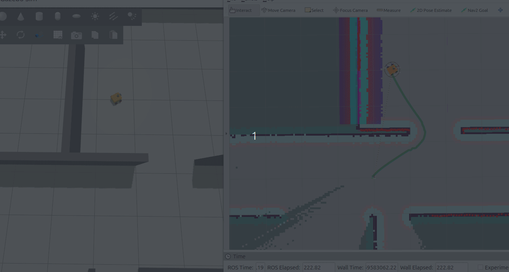

## MoboBot Gazebo Simulation | Dev PC



### Some Prerequisites

- Install and set up Cyclone DDS on your PC (if you don't have it installed yet).
  ```shell
  sudo apt install ros-jazzy-rmw-cyclonedds-cpp
  export RMW_IMPLEMENTATION=rmw_cyclonedds_cpp
  echo "export RMW_IMPLEMENTATION=rmw_cyclonedds_cpp" >> ~/.bashrc
  ```
  
- Create your MoboBot ROS Workspace
  ```shell
  mkdir -p ~/mobo_bot_ws/src
  cd ~/mobo_bot_ws
  colcon build
  source ~/mobo_bot_ws/install/setup.bash
  ```

- Clone the **arrow_key_telop_drive** package on your MoboBot ROS Workspace. This is the package that would be used for driving the MoboBot using the arrow keys of your keyboard
  ```shell
  sudo apt install python3-pip
  sudo apt install python3-pynput
  cd ~/mobo_bot_ws/src
  git clone https://github.com/samuko-things/arrow_key_teleop_drive.git
  ```
  Learn more about the [**arrow_key_teleop_drive**](https://github.com/samuko-things/arrow_key_teleop_drive)

- Build your workspace
  ```shell
  cd ~/mobo_bot_ws
  colcon build --symlink-install
  ```

### Clone and Build the MoboBot Packages  
- cd into the src folder of your mobo_bot_ws and download the **MoboBot** packages
  ```shell
  cd ~/mobo_bot_ws/src
  git clone https://github.com/robocre8/mobo_bot.git
  ```
  
- If you are not interested in running or testing the MoboBot hardware (i.e the actual robot), run the following command below. this will add the COLCON_IGNORE file to it.
  ```shell
  cd ~/mobo_bot_ws/src/mobo_bot/mobo_bot_base && touch COLCON_IGNORE
  ```

- cd into the root directory of your mobo_bot_ws and run rosdep to install all necessary ROS  package dependencies
  ```shell
  cd ~/mobo_bot_ws
  rosdep update
  rosdep install --from-paths src --ignore-src -r -y
  ```

- Build your mobo_bot_ws
  ```shell
  cd ~/mobo_bot_ws
  colcon build --symlink-install
  ```

#

### Set MoboBot Base Type Environment Variable  
- Depending on the base chassis type you are using run any of the command below:

  ```shell
  export MOBOBOT_BASE_TYPE=2WD
  echo "export MOBOBOT_BASE_TYPE=2WD" >> ~/.bashrc
  ```

  ```shell
  export MOBOBOT_BASE_TYPE=4WD
  echo "export MOBOBOT_BASE_TYPE=4WD" >> ~/.bashrc
  ```

  ```shell
  export MOBOBOT_BASE_TYPE=MEC
  echo "export MOBOBOT_BASE_TYPE=MEC" >> ~/.bashrc
  ```

  ```shell
  export MOBOBOT_BASE_TYPE=22WD
  echo "export MOBOBOT_BASE_TYPE=22WD" >> ~/.bashrc
  ```

#

### View Robot and Transform Tree
this shows the transformation between the differnt robot parts. it uses the **robot_state_publisher** the transforms, **RVIZ** to view the actual robot, and the **rqt_tf_tree** to view the transform graph.
- on your dev-PC, open a new terminal and launch the **tf_view** to view the transform
  ```shell
  source ~/mobo_bot_ws/install/setup.bash
  ros2 launch mobo_bot_bringup tf_view.launch.py use_hardware:=false
  ```

#

### Run the MoboBot simulation
- On your dev-PC, open a new terminal and start the mobo_bot_sim 
  ```shell
  source ~/mobo_bot_ws/install/setup.bash
  ros2 launch mobo_bot_bringup sim.launch.py
  ```
- In a different terminal, run the arrow_key_telop to drive the robot around using the arrow keys on your keyboard
  ```shell
  source ~/mobo_bot_ws/install/setup.bash- you'll be using the **mobo_bot_rviz** package on your dev-PC to visualize the robot.
  ros2 run arrow_key_teleop_drive arrow_key_teleop_drive 0.2 0.5 true
  ```
  >NOTE: you would need to click into the rviz or simulation for the 
  > arrow_key_teleop drive to start woking. because it uses pynput
  >
  >NOTE: also feel free to use any other **teleop package** you want 
  
#

### Run the MoboBot Mapping (Drive robot with teleop) - SLAM
Mapping is done with the SLAM Algorithm from the slam_toolbox package. The robot is drivin aroung via telop to create the map
- to just build map of the world with slam run:
  ```shell
  source ~/mobo_bot_ws/install/setup.bash
  ros2 launch mobo_bot_bringup sim_mapping.launch.py world_name:=room_with_walls
  ```
  > other worlds -> turtlebot_arena , room_with_walls_star, empty_room

- Then drive the robot around with teleop (as done previously) and see the map being created. continue driving till you are done mapping.

- run the command below to save the `occupancy grid` map to be used later with AMCL for localization 
</br>(map file would be saved in the `maps` folder inside the `mobo_bot_navigation` pakage folder)
 
  >**pls ensure the map_name is exactly the same as the name of the world being used as stated above**
  >```shell
  >   ros2 run nav2_map_server map_saver_cli -f ~/mobo_bot_ws/src/mobo_bot/mobo_bot_navigation/maps/<world_name> 
  >```

- run the command below to save the `serialized posegraph` map to be used later with SLAM for localization 
</br>(map file would be saved in the `maps` folder inside the `mobo_bot_navigation` pakage folder)
 
  >**pls ensure the map_name is exactly the same as the name of the world being used as stated above**
  >```shell
  >   ros2 service call /slam_toolbox/serialize_map slam_toolbox/srv/SerializePoseGraph "{'filename': '~/mobo_bot_ws/src/mobo_bot/mobo_bot_navigation/maps/<world_name>'}" 
  >```

#

### Run the MoboBot Mapping (Navigate with Nav2 while Mapping) - SLAM
The robot is able to map its evironment while running navigation. this is because the SLAM algorithm is able to localize the robot while creating the map of the environment. With this information of the robot location in the map being created, the robot is able to autonomously navigate to known poses on the map. 
- start the MoboBot launch to run the mapping alongside navigation:
  ```shell
  source ~/mobo_bot_ws/install/setup.bash
  ros2 launch mobo_bot_bringup sim_mapping.launch.py world:=room_with_walls use_nav:=true # params_name:=nav2_params_omni
  ```
  >**NOTE**: if you do not see any map generated initially, run the telep node to drive the robot to initially start the map generation 
  >then stop the teleop node as soon as you see the map being created and continue with 2D navigation

- Now use the Nav2Goal button to move the robot from point to point on the known area of the currently created map and see how the robot both navigates and simultaneously create the map.

- save the map (as done prevoiusly) once you are done mapping

#

### Run the MoboBot Navigation (With an already created Map) - AMCL or SLAM localization
The robot is able to autonomously navigate using the map of the environment created in the previous step. The Adaptive Monte Carlo Localization (AMCL) algorithm from Nav2 (or SLAM from slam_toolbox) is used to localize the robot (i.e know the where the robot is located) in the already created Map being used. With this information, the robot is able to autonomously navigate to different goal pose on the map.
>NOTE: the AMCL and SLAM are configured to use the initial position of the robot at the start of the simulation

- Launch the MoboBot Naviagtion (with AMCL):
  ```shell
  source ~/mobo_bot_ws/install/setup.bash
  ros2 launch mobo_bot_bringup sim_navigation.launch.py world_name:=room_with_walls # params_name:=sim_nav2_params
  ```

- Launch the MoboBot Naviagtion (with SLAM):
  ```shell
  source ~/mobo_bot_ws/install/setup.bash
  ros2 launch mobo_bot_bringup sim_navigation.launch.py world_name:=room_with_walls use_slam:=true # params_name:=sim_nav2_params
  ```

  >**NOTE**: you can change the world_name to the world you are woking with and have created a map for.

- Now use the Nav2Goal button to move the robot to any Goal pose on the map.


```